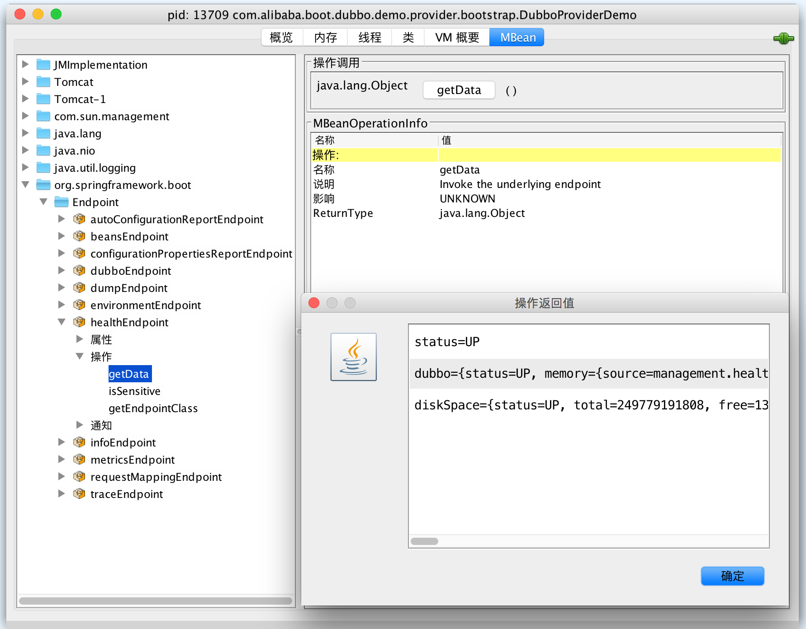

# Dubbo Spring Boot Production-Ready

`dubbo-spring-boot-actuator` 提供 Production-Ready 特性 (比如 [健康检查](#health-checks),  [OPS 端点](#endpoints), and [外部化配置](#externalized-configuration)).


## 目录

1. [主目录](https://github.com/dubbo/dubbo-spring-boot-project)
2. [Maven 整合](#integrate-with-maven)
3. [健康检查](#health-checks)
4. [OPS 端点](#endpoints)
5. [外部化配置](#externalized-configuration)


## Maven 整合

### 稳定版本

`dubbo-spring-boot-actuator` 是可选模块，它不应该独立存在，需要与 `dubbo-spring-boot-starter` 并存方可工作正常。您可以直接增加到
应用工程的 pom.xml 文件：


```xml
<dependencies>

    ...

    <!-- 功能特性 -->
    <dependency>
        <groupId>com.alibaba.boot</groupId>
        <artifactId>dubbo-spring-boot-starter</artifactId>
        <version>0.1.2</version>
    </dependency>

    <!-- Production-Ready 特性 -->
    <dependency>
        <groupId>com.alibaba.boot</groupId>
        <artifactId>dubbo-spring-boot-actuator</artifactId>
        <version>0.1.2</version>
    </dependency>

     ...

</dependencies>
```

### 开发版本

如果你需要尝试最新 `dubbo-spring-boot-actuator` 的特性，您可以自将[开发分支](../tree/0.1.x) 手动 Maven install 到本地 Maven 仓库。


## 健康检查

`dubbo-spring-boot-actuator` 实现了标准的 Spring Boot `HealthIndicator` , 它将聚合 Dubbo 相关的健康指标数据到 Spring Boot's `Health`
 ，并且 暴露在 `HealthEndpoint` ，它能够在 works MVC (Spring Web MVC) and JMX (Java Management Extensions) both if they are available.


### Web Endpoint : `/health`


假设 Spring Boot Web 应用没有指定 `management.port` 属性, 运行后，通过 Web 客户端访问 http://localhost:8080/health，HTTP 相应将会返回一个 JSON 格式的内容，如下所示:

```json
{
  "status": "UP",
  "dubbo": {
    "status": "UP",
    "memory": {
      "source": "management.health.dubbo.status.defaults",
      "status": {
        "level": "OK",
        "message": "max:3641M,total:383M,used:92M,free:291M",
        "description": null
      }
    },
    "load": {
      "source": "management.health.dubbo.status.extras",
      "status": {
        "level": "OK",
        "message": "load:1.73583984375,cpu:8",
        "description": null
      }
    },
    "threadpool": {
      "source": "management.health.dubbo.status.extras",
      "status": {
        "level": "OK",
        "message": "Pool status:OK, max:200, core:200, largest:0, active:0, task:0, service port: 12345",
        "description": null
      }
    },
    "server": {
      "source": "dubbo@ProtocolConfig.getStatus()",
      "status": {
        "level": "OK",
        "message": "/192.168.1.103:12345(clients:0)",
        "description": null
      }
    }
  }
  // ignore others
}
```


其中 `memory`, `load`,  `threadpool` and `server` 是 Dubbo 内建的 `StatusChecker`s，并且 Dubbo 允许应用程序扩展 `StatusChecker`'s SPI.

默认情况, `memory` and `load` 将被添加到 Dubbo 的 `HealthIndicator` , 可以通过外部化配置覆盖默认值，请参考 [`StatusChecker`'s 默认值](#statuschecker-defaults).


### JMX Endpoint : `healthEndpoint`


`dubbo-spring-boot-actuator` 也将暴露健康检查的 JMX Endpoint，它的 `ObjectName` 为 `org.springframework.boot:type=Endpoint,name=healthEndpoint` ,
 开发人员可以通过 JMX 代理工具 ,比如 `jconsole` 等：




### 内建 `StatusChecker`s


Dubbo 内建 `StatusChecker` 实现定义在 `META-INF/dubbo/internal/com.alibaba.dubbo.common.status.StatusChecker` 文件中，内容如下 :

```properties
registry=com.alibaba.dubbo.registry.status.RegistryStatusChecker
spring=com.alibaba.dubbo.config.spring.status.SpringStatusChecker
datasource=com.alibaba.dubbo.config.spring.status.DataSourceStatusChecker
memory=com.alibaba.dubbo.common.status.support.MemoryStatusChecker
load=com.alibaba.dubbo.common.status.support.LoadStatusChecker
server=com.alibaba.dubbo.rpc.protocol.dubbo.status.ServerStatusChecker
threadpool=com.alibaba.dubbo.rpc.protocol.dubbo.status.ThreadPoolStatusChecker
```


The property key that is name of  `StatusChecker` can be a valid value of `management.health.dubbo.status.*` in externalized configuration.


## Endpoints


Actuator endpoint `dubbo` supports Spring Web MVC Endpoints : 

| URI                 | HTTP Method | Description                         | Content Type       |
| ------------------- | ----------- | ----------------------------------- | ------------------ |
| `/dubbo`            | `GET`       | Exposes Dubbo's meta data           | `application/json` |
| `/dubbo/properties` | `GET`       | Exposes all Dubbo's Properties      | `application/json` |
| `/dubbo/services`   | `GET`       | Exposes all Dubbo's `ServiceBean`   | `application/json` |
| `/dubbo/references` | `GET`       | Exposes all Dubbo's `ReferenceBean` | `application/json` |
| `/dubbo/configs`    | `GET`       | Exposes all Dubbo's `*Config`       | `application/json` |
| `/dubbo/shutdown`   | `POST`      | Shutdown Dubbo services             | `application/json` |


### Endpoint : `/dubbo`

`/dubbo` exposes Dubbo's meta data : 

```json
{
  "timestamp": 1516623290166,
  "versions": {
    "dubbo-spring-boot": "1.0.0"
    "dubbo": "2.5.9"
  },
  "urls": {
    "dubbo": "https://github.com/alibaba/dubbo",
    "google-group": "http://groups.google.com/group/dubbo",
    "github": "https://github.com/dubbo/dubbo-spring-boot-project",
    "issues": "https://github.com/dubbo/dubbo-spring-boot-project/issues",
    "git": "https://github.com/dubbo/dubbo-spring-boot-project.git"
  }
}
```


### Endpoint : `/dubbo/properties`

`/dubbo/properties` exposes all Dubbo's Properties from Spring Boot Externalized Configuration (a.k.a `PropertySources`) : 

```json
{
  "dubbo.application.id": "dubbo-provider-demo",
  "dubbo.application.name": "dubbo-provider-demo",
  "dubbo.application.qos-enable": "false",
  "dubbo.application.qos-port": "33333",
  "dubbo.protocol.id": "dubbo",
  "dubbo.protocol.name": "dubbo",
  "dubbo.protocol.port": "12345",
  "dubbo.registry.address": "N/A",
  "dubbo.registry.id": "my-registry",
  "dubbo.scan.base-packages": "com.alibaba.boot.dubbo.demo.provider.service"
}
```

The structure of JSON is simple Key-Value format , the key is property name as and the value is property value.


### Endpoint : `/dubbo/services`

`/dubbo/services` exposes all Dubbo's `ServiceBean` that are declared via `<dubbo:service/>` or `@Service`  present in Spring `ApplicationContext` :

```json
{
  "ServiceBean@com.alibaba.boot.dubbo.demo.api.DemoService#defaultDemoService": {
    "accesslog": null,
    "actives": null,
    "cache": null,
    "callbacks": null,
    "class": "com.alibaba.dubbo.config.spring.ServiceBean",
    "cluster": null,
    "connections": null,
    "delay": null,
    "document": null,
    "executes": null,
    "export": null,
    "exported": true,
    "filter": "",
    "generic": "false",
    "group": null,
    "id": "com.alibaba.boot.dubbo.demo.api.DemoService",
    "interface": "com.alibaba.boot.dubbo.demo.api.DemoService",
    "interfaceClass": "com.alibaba.boot.dubbo.demo.api.DemoService",
    "layer": null,
    "listener": "",
    "loadbalance": null,
    "local": null,
    "merger": null,
    "mock": null,
    "onconnect": null,
    "ondisconnect": null,
    "owner": null,
    "path": "com.alibaba.boot.dubbo.demo.api.DemoService",
    "proxy": null,
    "retries": null,
    "scope": null,
    "sent": null,
    "stub": null,
    "timeout": null,
    "token": null,
    "unexported": false,
    "uniqueServiceName": "com.alibaba.boot.dubbo.demo.api.DemoService:1.0.0",
    "validation": null,
    "version": "1.0.0",
    "warmup": null,
    "weight": null,
    "serviceClass": "com.alibaba.boot.dubbo.demo.provider.service.DefaultDemoService"
  }
}
```

The key is the Bean name of `ServiceBean` , `ServiceBean`'s properties compose value.


### Endpoint : `/dubbo/references`

`/dubbo/references` exposes all Dubbo's `ReferenceBean` that are declared via `@Reference` annotating on `Field` or `Method  ` :

```json
{
  "private com.alibaba.boot.dubbo.demo.api.DemoService com.alibaba.boot.dubbo.demo.consumer.controller.DemoConsumerController.demoService": {
    "actives": null,
    "cache": null,
    "callbacks": null,
    "class": "com.alibaba.dubbo.config.spring.ReferenceBean",
    "client": null,
    "cluster": null,
    "connections": null,
    "filter": "",
    "generic": null,
    "group": null,
    "id": "com.alibaba.boot.dubbo.demo.api.DemoService",
    "interface": "com.alibaba.boot.dubbo.demo.api.DemoService",
    "interfaceClass": "com.alibaba.boot.dubbo.demo.api.DemoService",
    "layer": null,
    "lazy": null,
    "listener": "",
    "loadbalance": null,
    "local": null,
    "merger": null,
    "mock": null,
    "objectType": "com.alibaba.boot.dubbo.demo.api.DemoService",
    "onconnect": null,
    "ondisconnect": null,
    "owner": null,
    "protocol": null,
    "proxy": null,
    "reconnect": null,
    "retries": null,
    "scope": null,
    "sent": null,
    "singleton": true,
    "sticky": null,
    "stub": null,
    "stubevent": null,
    "timeout": null,
    "uniqueServiceName": "com.alibaba.boot.dubbo.demo.api.DemoService:1.0.0",
    "url": "dubbo://localhost:12345",
    "validation": null,
    "version": "1.0.0",
    "invoker": {
      "class": "com.alibaba.dubbo.common.bytecode.proxy0"
    }
  }
}
```

The key is the string presentation of `@Reference` `Field` or `Method  `  , `ReferenceBean`'s properties compose value.


### Endpoint : `/dubbo/configs`

 `/dubbo/configs` exposes all Dubbo's `*Config` :

```json
{
  "ApplicationConfig": {
    "dubbo-consumer-demo": {
      "architecture": null,
      "class": "com.alibaba.dubbo.config.ApplicationConfig",
      "compiler": null,
      "dumpDirectory": null,
      "environment": null,
      "id": "dubbo-consumer-demo",
      "logger": null,
      "name": "dubbo-consumer-demo",
      "organization": null,
      "owner": null,
      "version": null
    }
  },
  "ConsumerConfig": {
    
  },
  "MethodConfig": {
    
  },
  "ModuleConfig": {
    
  },
  "MonitorConfig": {
    
  },
  "ProtocolConfig": {
    "dubbo": {
      "accepts": null,
      "accesslog": null,
      "buffer": null,
      "charset": null,
      "class": "com.alibaba.dubbo.config.ProtocolConfig",
      "client": null,
      "codec": null,
      "contextpath": null,
      "dispatcher": null,
      "dispather": null,
      "exchanger": null,
      "heartbeat": null,
      "host": null,
      "id": "dubbo",
      "iothreads": null,
      "name": "dubbo",
      "networker": null,
      "path": null,
      "payload": null,
      "port": 12345,
      "prompt": null,
      "queues": null,
      "serialization": null,
      "server": null,
      "status": null,
      "telnet": null,
      "threadpool": null,
      "threads": null,
      "transporter": null
    }
  },
  "ProviderConfig": {
    
  },
  "ReferenceConfig": {
    
  },
  "RegistryConfig": {
    
  },
  "ServiceConfig": {
    
  }
}
```

The key is the simple name of Dubbo `*Config`  Class , the value is`*Config` Beans' Name-Properties Map.


### Endpoint : `/dubbo/shutdown`

`/dubbo/shutdown` shutdowns Dubbo's components including registries, protocols, services and references :

```json
{
    "shutdown.count": {
        "registries": 0,
        "protocols": 1,
        "services": 0,
        "references": 1
    }
}
```

"shutdown.count" means the count of shutdown of Dubbo's components , and the value indicates how many components have been shutdown.


## Externalized Configuration


### `StatusChecker` Defaults


`management.health.dubbo.status.defaults` is a property name for setting names of `StatusChecker`s , its value is allowed to multiple-values , for example : 

```properties
management.health.dubbo.status.defaults = registry,memory,load
```


#### Default Value

The default value is : 

```properties
management.health.dubbo.status.defaults = memory,load
```


### `StatusChecker` Extras


`management.health.dubbo.status.extras` is used to override the [ [`StatusChecker`'s defaults]](#statuschecker-defaults) , the multiple-values is delimited by comma :

```properties
management.health.dubbo.status.extras = load,threadpool
```


### Health Checks Enabled


`management.health.dubbo.enabled` is a enabled configuration to turn on or off health checks feature, its' default is `true`.

 If you'd like to disable health checks ,  you chould apply `management.health.dubbo.enabled` to be `false`:

```properties
management.health.dubbo.enabled = false
```


### Endpoints Enabled


Dubbo Spring Boot providers actuator endpoint `dubbo` , however it is disable. If you'd like to enable it , please add following property into externalized configuration :

```properties
# Dubbo Endpoint enabled (default value is false)
endpoints.dubbo.enabled = true
```


### Endpoints Sensitive

Dubbo endpoints contain some sensitive information and significant opeations , thus it's sensitive , that means endpoints maybe protected and authorized if security resolved.


If you consider it's fine to be public , you can add following property into externalized configuration :

```properties
# Dubbo Endpoint (default value is true)
endpoints.dubbo.sensitive = false
```

> If Spring Security were resolved , configure more :
>
> ```properties
> management.security.enabled = false
> ```
