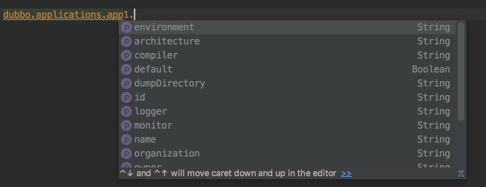

# Dubbo Spring Boot Auto-Configure

`dubbo-spring-boot-autoconfigure` uses Spring Boot's `@EnableAutoConfiguration` which helps core Dubbo's components to be auto-configured by `DubboAutoConfiguration`. It reduces code, eliminates XML configuration. 


## Content

1. [Main Content](https://github.com/dubbo/dubbo-spring-boot-project)
2. [Integrate with Maven](#integrate-with-maven)
3. [Auto Configuration](#auto-configuration)
4. [Externalized Configuration](#externalized-configuration)
5. [Dubbo Annotation-Driven (Chinese)](https://github.com/mercyblitz/blogs/blob/master/java/dubbo/Dubbo-Annotation-Driven.md)
6. [Dubbo Externalized Configuration (Chinese)](https://github.com/mercyblitz/blogs/blob/master/java/dubbo/Dubbo-Externalized-Configuration.md)


## Integrate with Maven

You can introduce the latest `dubbo-spring-boot-autoconfigure` to your project by adding the following dependency to your pom.xml

```xml
<dependency>
    <groupId>org.apache.dubbo</groupId>
    <artifactId>dubbo-spring-boot-autoconfigure</artifactId>
    <version>2.7.4.1</version>
</dependency>
```

If your project failed to resolve the dependency, try to add the following repository:
```xml
<repositories>
    <repository>
        <id>apache.snapshots.https</id>
        <name>Apache Development Snapshot Repository</name>
        <url>https://repository.apache.org/content/repositories/snapshots</url>
        <releases>
            <enabled>false</enabled>
        </releases>
        <snapshots>
            <enabled>true</enabled>
        </snapshots>
    </repository>
</repositories>
```


## Auto Configuration

Since  `2.5.7`  , Dubbo totally supports Annotation-Driven , core Dubbo's components that are registered and initialized in  Spring application context , including exterialized configuration features. However , those features need to trigger in manual configuration , e.g `@DubboComponentScan` , `@EnableDubboConfig` or `@EnableDubbo`.

> If you'd like to learn more , please read [Dubbo Annotation-Driven (Chinese)](http://dubbo.apache.org/zh-cn/blog/dubbo-annotation-driven.html)


`dubbo-spring-boot-autoconfigure` uses Spring Boot's `@EnableAutoConfiguration` which helps core Dubbo's components to be auto-configured by `DubboAutoConfiguration`. It reduces code, eliminates XML configuration. 


## Externalized Configuration

Externalized Configuration is a core feature of Spring Boot , Dubbo Spring Boot not only supports it definitely , but also inherits Dubbo's Externalized Configuration, thus it provides single and multiple Dubbo's `*Config` Bindings from `PropertySources` , and `"dubbo."` is a common prefix of property name.

> If you'd like to learn more , please read [Dubbo Externalized Configuration](http://dubbo.apache.org/zh-cn/blog/dubbo-externalized-configuration.html)(Chinese).


### Single Dubbo Config Bean Bindings

In most use scenarios , "Single Dubbo Config Bean Bindings" is enough , because a Dubbo application only requires single Bean of `*Config` (e.g `ApplicationConfig`). You add properties in `application.properties` to configure Dubbo's `*Config` Beans that you want , be like this :

```properties
dubbo.application.name = foo
dubbo.application.owner = bar
dubbo.registry.address = 10.20.153.10:9090
```

There are two Spring Beans will be initialized when Spring `ApplicatonContext` is ready, their Bean types are `ApplicationConfig` and `RegistryConfig`.


#### Getting Single Dubbo Config Bean

 If application requires current `ApplicationConfig` Bean in somewhere , you can get it from Spring `BeanFactory` as those code :

```java
BeanFactory beanFactory = .... 
ApplicationConfig applicationConfig = beanFactory.getBean(ApplicationConfig.class)
```

or inject it :

```java
@Autowired
private ApplicationConfig application;
```


#### Identifying Single Dubbo Config Bean

If you'd like to identify this `ApplicationConfig` Bean , you could add **"id"** property:

```properties
dubbo.application.id = application-bean-id
```


#### Mapping Single Dubbo Config Bean

The whole Properties Mapping of "Single Dubbo Config Bean Bindings" lists below :

| Dubbo `*Config` Type | The prefix of property name for Single Bindings |
| -------------------- | ---------------------------------------- |
| `ProtocolConfig`     | `dubbo.protocol`                         |
| `ApplicationConfig`  | `dubbo.application`                      |
| `ModuleConfig`       | `dubbo.module`                           |
| `RegistryConfig`     | `dubbo.registry`                         |
| `MonitorConfig`      | `dubbo.monitor`                          |
| `ProviderConfig`     | `dubbo.provider`                         |
| `ConsumerConfig`     | `dubbo.consumer`                         |


An example properties :

```properties
# Single Dubbo Config Bindings
## ApplicationConfig
dubbo.application.id = applicationBean
dubbo.application.name = dubbo-demo-application

## ModuleConfig
dubbo.module.id = moduleBean
dubbo.module.name = dubbo-demo-module

## RegistryConfig
dubbo.registry.address = zookeeper://192.168.99.100:32770

## ProtocolConfig
dubbo.protocol.name = dubbo
dubbo.protocol.port = 20880

## MonitorConfig
dubbo.monitor.address = zookeeper://127.0.0.1:32770

## ProviderConfig
dubbo.provider.host = 127.0.0.1

## ConsumerConfig
dubbo.consumer.client = netty
```


### Multiple Dubbo Config Bean Bindings

In contrast , "Multiple Dubbo Config Bean Bindings" means Externalized Configuration will be used to configure multiple Dubbo `*Config` Beans.


#### Getting Multiple Dubbo Config Bean

The whole Properties Mapping of "Multiple Dubbo Config Bean Bindings" lists below :

| Dubbo `*Config` Type | The prefix of property name for Multiple Bindings |
| -------------------- | ---------------------------------------- |
| `ProtocolConfig`     | `dubbo.protocols`                        |
| `ApplicationConfig`  | `dubbo.applications`                     |
| `ModuleConfig`       | `dubbo.modules`                          |
| `RegistryConfig`     | `dubbo.registries`                       |
| `MonitorConfig`      | `dubbo.monitors`                         |
| `ProviderConfig`     | `dubbo.providers`                        |
| `ConsumerConfig`     | `dubbo.consumers`                        |


#### Identifying Multiple Dubbo Config Bean

There is a  different way to identify Multiple Dubbo Config Bean , the configuration pattern is like this :

`${config-property-prefix}.${config-bean-id}.${property-name} = some value` , let's explain those placehoders : 

- `${config-property-prefix}` : The The prefix of property name for Multiple Bindings , e.g. `dubbo.protocols`, `dubbo.applications` and so on.
- `${config-bean-id}` : The bean id of Dubbo's `*Config`
- `${property-name}`: The property name of  `*Config`

An example properties :

```properties
dubbo.applications.application1.name = dubbo-demo-application
dubbo.applications.application2.name = dubbo-demo-application2
dubbo.modules.module1.name = dubbo-demo-module
dubbo.registries.registry1.address = zookeeper://192.168.99.100:32770
dubbo.protocols.protocol1.name = dubbo
dubbo.protocols.protocol1.port = 20880
dubbo.monitors.monitor1.address = zookeeper://127.0.0.1:32770
dubbo.providers.provider1.host = 127.0.0.1
dubbo.consumers.consumer1.client = netty
```


### IDE Support


If you used advanced IDE tools , for instance [Jetbrains IDEA Ultimate](https://www.jetbrains.com/idea/) develops Dubbo Spring Boot application, it will popup the tips of Dubbo Configuration Bindings in `application.properties` : 


#### Case 1 - Single Bindings


#### Case 2 - Mutiple Bindings



​

